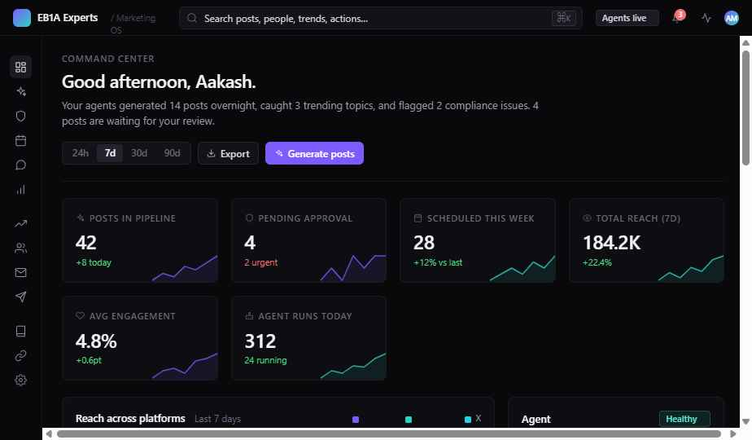
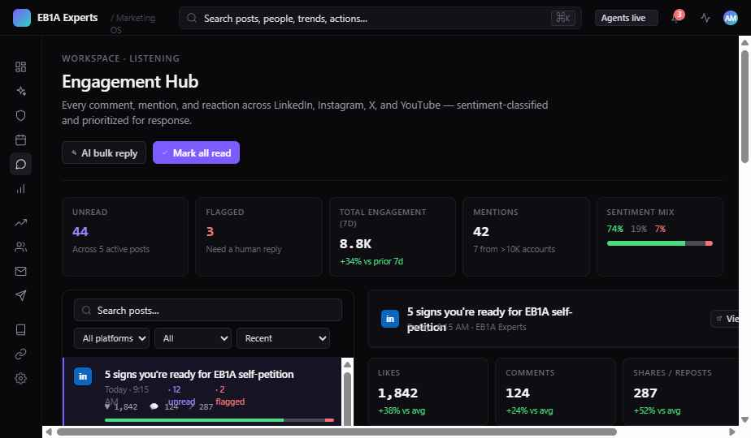

# EB1A Experts — Marketing OS

> An AI-assisted marketing operations console for an EB1A immigration practice. Concept demo, fully interactive UI, dummy data only.

[](https://github.com/eb1aexperts/marketing-os/actions/workflows/pages.yml)
[]()
[](./LICENSE)

---

## What this is

**Marketing OS** is an internal R&D prototype exploring what a single, opinionated console for content marketing at an EB1A practice would look like. Instead of stitching together Buffer + Hootsuite + a CRM + a spreadsheet of ideas, the demo imagines one screen per job-to-be-done:

- **Command Center** — overnight agent activity, what needs your attention, where reach is trending.
- **Content Queue & Approval** — drafts produced by AI agents move through a side-by-side, stack, or mobile-preview review flow.
- **Calendar** — week / month view of scheduled posts across LinkedIn, Instagram, X, Facebook, YouTube, Medium.
- **Engagement Hub** — likes / comments / mentions / sentiment per post, consolidated across platforms.
- **Trends & Influencers** — competitor tracking, trending topics, influencer shortlists.
- **Daily Brief & Email Reports** — recurring digests configurable per-recipient.
- **Settings, Integrations, Knowledge Base** — onboarding, brand voice, SEO connectors.

Everything renders today; everything is wired to dummy data in `components/data.jsx`.

---

## Screenshots

> Demo running with the default dark theme and violet accent.

### Command Center



### Engagement Hub



---

## Tech stack

| Layer | Choice | Why |
|---|---|---|
| UI | React 18 (UMD) | Familiar, no install needed for a demo |
| Compilation | `@babel/standalone` | JSX in the browser — zero build step |
| Styles | Hand-written CSS + CSS variables | Theme tokens (`--accent`, density, dark/light) live in one place |
| Fonts | Google Fonts (Inter Tight, Inter, JetBrains Mono, Instrument Serif) | Selectable from the in-app tweaks panel |
| State | Tiny singleton `Store` (`components/store.jsx`) | One source of truth for posts, toasts, modals, notifications |
| Hosting | GitHub Pages (static) | Free, fast, and matches the zero-build philosophy |

No package manager, no bundler, no server. Open `index.html` and it works.

---

## Run locally

You can double-click `index.html`, but most browsers block ES modules / fetches over `file://`. The reliable path is to serve the folder over HTTP:

```bash
# Python 3 (any OS)
python3 -m http.server 8000

# OR Node
npx serve .

# OR PHP (built-in)
php -S localhost:8000
```

Then open <http://localhost:8000/>.

The first paint is slightly slower because Babel compiles all `.jsx` files in the browser. Subsequent navigations are instant — everything is in-memory.

### Keyboard shortcuts

| Shortcut | Action |
|---|---|
| `⌘K` / `Ctrl+K` | Open the command palette |
| `⌘1`–`⌘6` | Jump to Dashboard / Queue / Approval / Calendar / Engagement / Analytics |
| `Esc` | Close palette or any open modal |

---

## Deploy to GitHub Pages

A workflow is already included at `.github/workflows/pages.yml`. To go live:

1. Push this repo to GitHub.
2. **Settings → Pages → Build and deployment → Source**: select **GitHub Actions**.
3. Push to `main` (or run the workflow manually from the Actions tab).
4. Your site will be at `https://<your-org>.github.io/<repo-name>/`.

The workflow publishes the entire repo root as static files and adds a `.nojekyll` marker so Pages doesn't try to process the project with Jekyll.

---

## Project structure

```
.
├── index.html                   # GitHub Pages entry point
├── EB1A Marketing Platform.html # Original entry (kept for backward compat)
├── styles.css                   # Tokens, layout, component styles
├── styles-modals.css            # Overlay & modal styles
├── tweaks-panel.jsx             # In-app theme/density/accent tweaker
├── components/                  # All React screens & shared modules
├── qa/                          # Reference screenshots
├── uploads/                     # Internal brand reference (review before publishing)
├── .github/workflows/pages.yml  # Auto-deploy to GitHub Pages
├── .nojekyll                    # Tell Pages not to run Jekyll
├── .gitignore
├── LICENSE                      # Proprietary — All Rights Reserved
└── CONTRIBUTING.md
```

---

## Dummy-data disclaimer

Every name, handle, post, comment, sentiment score, follower count, competitor, influencer, and metric in this repo is **fictitious**. No real client data is shipped. Before introducing any real data, swap out the contents of `components/data.jsx` and audit `components/engagement.jsx` for inline mock comments.

---

## Roadmap

Ideas we're exploring next, roughly in priority order:

**Near-term (next iteration)**
- Wire the Approval Workflow to a real LLM endpoint for one-click rewrite suggestions.
- Replace dummy `Store` with persistence (initially `localStorage`, then a small Supabase / Postgres backend).
- Real OAuth for LinkedIn, Instagram Graph, and X publishing APIs.
- Per-platform character / asset constraints surfaced inline in the editor.

**Mid-term**
- Brand-voice guardrails: train a small model on the `Brand Guidelines.pdf` and use it to score drafts before they reach the queue.
- Sentiment + intent classification on incoming comments and DMs (currently mocked).
- Influencer outreach: contact-card → templated DM → tracked reply state.
- Calendar conflict detection across platforms (over-posting, cannibalization).

**Long-term**
- Multi-tenant: support more than one practice on the same install.
- Reporting agents: weekly auto-generated narrative summaries delivered as PDF.
- A/B test framework on hooks, openers, and CTAs across LinkedIn vs. X.
- Plug-in surface so a paralegal team can add custom screens without touching core.

---

## License

Proprietary — © 2026 EB1A Experts. All rights reserved. See [LICENSE](./LICENSE).

This repository is published for **demonstration and showcase purposes only**. Public visibility does not grant a license to copy, modify, or redistribute. For licensing or partnership inquiries: **contact@eb1aexperts.com**.

---

## Contributing

See [CONTRIBUTING.md](./CONTRIBUTING.md) for layout, code style, and what not to commit.
